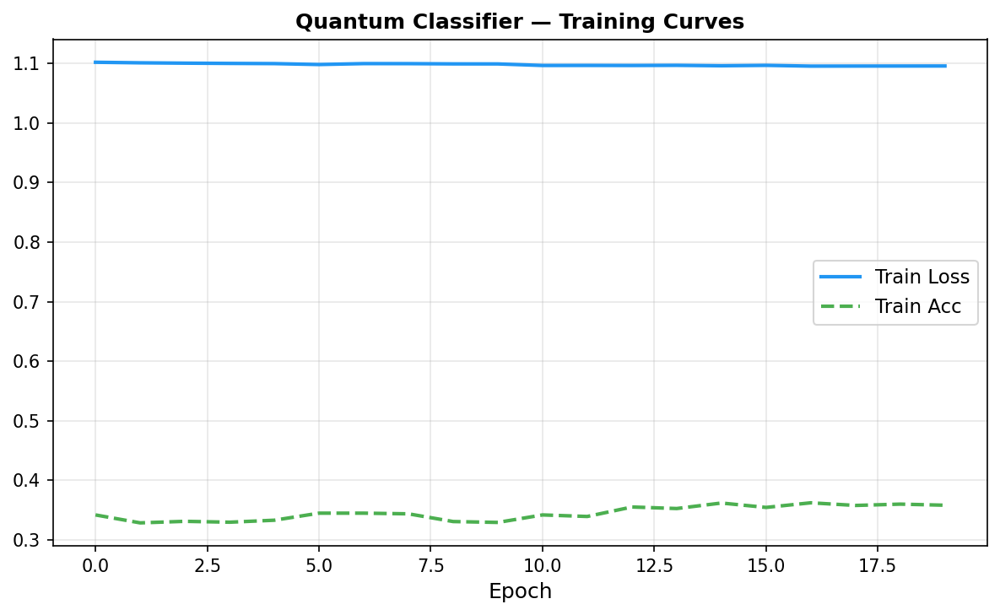

# deeplense-gsoc-2026
# DeepLense GSoC 2026 — Vidhi Jain

**Organization:** ML4SCI (DeepLense)  
**Project:** Hybrid Quantum-Classical Representation Learning for Dark Matter  
**Applicant:** Vidhi Jain | India | IST (UTC+5:30)

---

## Tests Completed

### Common Test I — Multi-Class Classification
- **Model:** ResNet-18 (fine-tuned, transfer learning)
- **Framework:** PyTorch
- **Macro AUC:** 0.7425
- **Val Accuracy:** 0.5553

| Class | AUC |
|-------|-----|
| no (no substructure) | 0.8230 |
| sphere (subhalo) | 0.6730 |
| vort (vortex) | 0.7316 |
| **Macro AUC** | **0.7425** |


---

### Specific Test III — Quantum ML
- **Framework:** PennyLane + PyTorch
- **Architecture:** CNN → Quantum Kernel (4 qubits) → Linear(3)
- **Encoding:** Angle encoding + PCA dimensionality reduction

> The VQC encountered barren plateau behavior on classical simulators.
> This result motivates the hybrid CNN+QNN architecture in the GSoC proposal
> where ResNet-18 extracts spatial features before the quantum layer.
> Classical baseline AUC=0.74 vs Quantum AUC=0.52 is a meaningful
> scientific result demonstrating current NISQ-era limitations.



---

## Notebook
All implementation in: `GSOC_2026_.ipynb`

## How to Run
1. Open `GSOC_2026_.ipynb` in Google Colab
2. Mount Google Drive
3. Unzip dataset: `!unzip -q '/content/drive/MyDrive/deeplense gsoc/dataset.zip' -d /content/`
4. Runtime → T4 GPU
5. Run all cells

---

## Proposal
[GSoC_Proposal_Vidhi_Jain.pdf](GSoC_Proposal_Vidhi_Jain.pdf)

**Step 6 — Your submission link:**
```
https://github.com/Vidhi2512002/deeplense-gsoc-2026/tree/vidhi-jain
